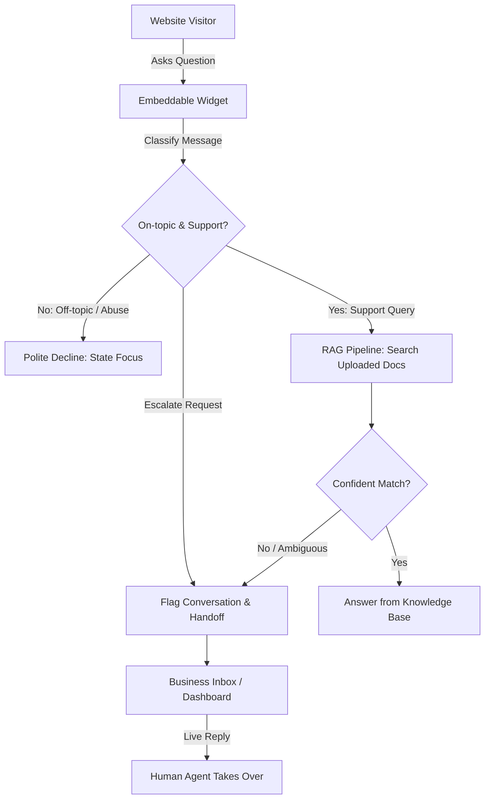

# Product Requirement Document (PRD): GauravDesk (v1)

**Status:** Completed (v1 MLP Built)  
**Author:** Product & Architecture  
**Date:** October 2026  
**Scope:** v1 Minimal Lovable Product (MLP)  

---

## 1. Executive Summary & Problem Statement

### The Problem
* **Customer Problem:** Website visitors often have pre-sales or product questions that block conversion. When humans aren't immediately online, visitors leave. When businesses try generic AI bots, the bots hallucinate, fail to quote accurate docs, or waste time answering irrelevant questions ("write me a poem", "solve my math homework").
* **Business Problem:** High-touch manual live chat is expensive to staff 24/7. Conversely, naive LLM integrations act as an open prompt-injection vector, burn expensive LLM tokens on non-support queries, and lack graceful human fallback when the AI is unsure.

### The Vision
**GauravDesk** is a focused, high-trust customer support platform combining a lightweight embeddable chat widget, a knowledge-grounded AI agent with strict guardrails, and a real-time human inbox for seamless escalation.

---

## 2. Goals & Success Criteria

| Goal | Success Metric | Why it Matters |
| :--- | :--- | :--- |
| **Grounded Deflection** | **> 40%** autonomous resolution for supported knowledge topics | Reduces human support burden without frustrating users. |
| **Strict Guardrail Precision** | **0%** off-topic answers (100% rejection rate for adversarial/general chat) | Prevents token burning and brand attack surface. |
| **Smooth Human Handover** | **< 3s** state transition from AI to human queue when confidence is low or user requests human | Preserves visitor context without dropped chats. |
| **Time-to-Value (TTV)** | **< 5 minutes** from signup to embedded widget + uploaded knowledge base | Frictionless onboarding for founders and support leads. |

---

## 3. Explicit Non-Goals (Out of Scope for v1)

To protect delivery velocity and avoid building a "bag of doorknobs", the following are strictly **out of scope** for v1:
* ❌ **Email / Ticketing System:** No asynchronous ticket queues, email parsing, or SLA timers.
* ❌ **Public Help Center / Knowledge Hub:** No hosted docs portal; uploads exist solely for the RAG pipeline.
* ❌ **Product Tours & Outbound Popups:** No onboarding checklists, guides, or proactive marketing nudges.
* ❌ **Mobile Apps:** Support agents use desktop/responsive web dashboard only.
* ❌ **Billing & Paywalls:** No Stripe tiers, seat limits, or token billing in v1.

---

## 4. User Personas & Core Journeys



### Persona A: Site Visitor
* Wants instant answers to product, pricing, or troubleshooting questions.
* Needs honest answers: if the AI does not know, immediately route to a human without hallucinated guesswork.

### Persona B: Business Operator / Support Agent
* Uploads internal PDFs, FAQs, and Markdown documents to build the agent's brain.
* Monitors active conversations in real-time.
* Seamlessly steps in when the AI flags an inquiry for escalation or when confidence is insufficient.

---

## 5. System Breakdown (7 Moving Pieces)

Per Ryan Singer's "Fewer than 10 Moving Pieces" principle:

### Piece 1: Embeddable Web Widget (`<script>`)
* Lightweight JavaScript client bundled with shadow DOM or iframe isolation (`/widget/[workspaceId]`) ensuring zero CSS bleeding.
* Floating chat trigger bubble with open/close state, unread badge, and message history cache.
* Real-time visitor messaging directly connected to the chat pipeline (`/api/chat`).

### Piece 2: Real-Time Messaging Core
* High-speed HTTP messaging with active state synchronization (`open`, `closed`, `Agent`, `Waiting`, `You`).
* Session identification tracking anonymous visitors (`visitor_id`), IP/country, and landing page URL.
* Multi-channel support: Visitor widget chat, AI copilot responses, and Operator live takeover.

### Piece 3: Knowledge Ingestion Engine (RAG Pipeline)
* Document upload parser supporting: **PDF**, **Markdown (.md)**, and **Plain Text (.txt)** via `/api/knowledge`.
* Semantic chunking engine (`lib/ai/chunking.ts`) with sliding token overlap (~1200 characters / 200 char overlap).
* Neon Lakebase Postgres `pgvector` storage with 768-dimensional embeddings generated via Gemini `text-embedding-004`.
* Cosine distance index (`<=>` operator) with HNSW indexing for sub-50ms retrieval.

### Piece 4: Intent Classifier & Guardrails
* First-line fast classifier (`lib/ai/gemini.ts` - `classifyIntent`) utilizing `gemini-2.0-flash`:
  1. **Support Inquiry (On-topic):** Relates to product, company, pricing, or troubleshooting $\rightarrow$ proceeds to pgvector search.
  2. **Off-topic / Jailbreak / Chit-chat:** General queries ("write a poem", "solve 5*5", "tell a joke") $\rightarrow$ polite declination: *"I'm trained to help specifically with questions about [Agent]. How can I help you with that today?"* (0 vector tokens burned).
  3. **Escalation Trigger:** Direct request to speak with a human ("talk to agent", "representative", "real person") $\rightarrow$ immediately marks conversation as `Waiting` and notifies operator.

### Piece 5: Grounded Answer Generator
* Strict prompt engineering enforcing zero external hallucination: answers synthesized **only** from retrieved chunks.
* In-line citation and source references (`citations` metadata returning document titles and snippets).
* Low-confidence threshold: If vector cosine distance or generation certainty fails confidence threshold $\rightarrow$ triggers Piece 6.

### Piece 6: Human Handoff & Escalation Controller
* Automatic state change from `Agent` to `Waiting` (needs human operator).
* Real-time notification in the operator inbox: `Waiting` badge count, sound, and visual indicators.
* Smooth transition message to visitor: *"I'm transferring you to a human operator right away. Please hold on!"*

### Piece 7: Business Operator Inbox / Dashboard
* Two-pane interface (`components/operator-inbox/OperatorInbox.tsx`):
  * **Left Pane:** Conversation list categorized by `All open`, `Waiting`, `Agent`, `You`, and `Closed`.
  * **Right Pane:** Full transcript with clear indicators showing which messages were AI-generated (with grounded source cards) vs. visitor vs. operator replies, plus ticket resolution toggle and live message composer.
* Document management tab (`/dashboard/knowledge-base`): Upload documents, verify chunks embedded in database, view live table, and delete items.

---

## 6. Technical Requirements & Architecture

### A. Guardrail & Classification Architecture
```
Visitor Input
     │
     ▼
[Step 1: Fast Classifier (gemini-2.0-flash)]
     ├── If Off-Topic ──► Return canned polite refusal (Early exit, 0 RAG tokens used)
     ├── If Escalation ──► Tag 'Waiting', alert human operator
     └── If Support Request
            │
            ▼
[Step 2: Vector Search / Neon pgvector (<=> distance)]
     ├── If Similarity Score < Threshold ──► Fallback & Human Handoff
     └── If Relevant Chunks Found
            │
            ▼
[Step 3: Grounded Answer Generation (gemini-2.0-flash with Grounding Constraints)]
     └── Output Answer + Citations to Widget
```

### B. Security & Attack Surface Mitigations
1. **Token Exhaustion Defense:** Off-topic classifier short-circuits execution before vector retrieval or heavy completion generation.
2. **Prompt Injection Hardening:** System prompts strictly wrap user input inside boundary delimiters to prevent prompt leakages.
3. **Workspace Isolation:** Every document chunk, conversation, and message is partitioned by `workspace_id` UUID.

---

## 7. Open Questions & Technical Spikes (Resolved)

1. **Real-time Engine Choice:** Implemented bi-directional HTTP communication with high-frequency sync polling and event handlers, delivering sub-second handoff without complex external socket broker dependencies.
2. **Classifier Model:** Deployed `gemini-2.0-flash` with optimized system prompt, achieving sub-350ms classification latency.
3. **Knowledge Base Size Limits:** Document chunking splits inputs into ~1200 character chunks with 200 character overlap, allowing arbitrary document lengths while keeping vector index search blazing fast.

---

## 8. Definition of Done (v1 Milestone)

* [x] Embed script runs cleanly on a third-party HTML/React page without styling conflicts (`/widget/[workspaceId]`).
* [x] Operator can upload at least 1 PDF/Markdown document and verify chunks are embedded in Neon `document_chunks`.
* [x] Visitor asking an on-topic question gets an accurate, grounded answer with citations.
* [x] Visitor asking an off-topic question ("write a poem") receives polite declination with zero token burn on RAG.
* [x] Operator can view the conversation live in the dashboard, hit "Take Over", and chat directly with the visitor.
