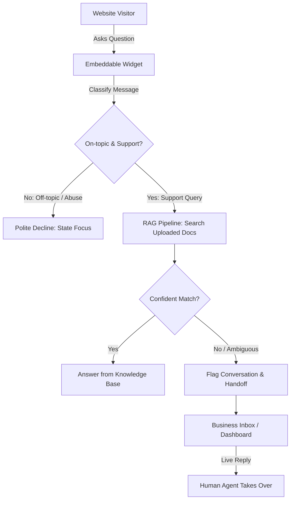

# Product Requirement Document (PRD): GauravDesk (v1)

**Status:** Ready for Review  
**Author:** Product & Architecture  
**Date:** October 2026  
**Scope:** v1 Minimal Lovable Product (MLP)  

---

## 1. Executive Summary & Problem Statement

### The Problem
* **Customer Problem:** Website visitors often have pre-sales or product questions that block conversion. When humans aren't immediately online, visitors leave. When businesses try generic AI bots, the bots hallucinate, fail to quote accurate docs, or waste time answering irrelevant questions ("write me a poem", "solve my math homework").
* **Business Problem:** High-touch manual live chat is expensive to staff 24/7. Conversely, naive LLM integrations act as an open prompt-injection vector, burn expensive LLM tokens on non-support queries, and lack graceful human fallback when the AI is unsure.

### The Vision
**GauravDesk** is a focused, high-trust customer support platform combining a lightweight embeddable chat widget, a knowledge-grounded AI agent with strict guardrails, and a real-time human inbox for seamless escalation.

---

## 2. Goals & Success Criteria

| Goal | Success Metric | Why it Matters |
| :--- | :--- | :--- |
| **Grounded Deflection** | **> 40%** autonomous resolution for supported knowledge topics | Reduces human support burden without frustrating users. |
| **Strict Guardrail Precision** | **0%** off-topic answers (100% rejection rate for adversarial/general chat) | Prevents token burning and brand attack surface. |
| **Smooth Human Handover** | **< 3s** state transition from AI to human queue when confidence is low or user requests human | Preserves visitor context without dropped chats. |
| **Time-to-Value (TTV)** | **< 5 minutes** from signup to embedded widget + uploaded knowledge base | Frictionless onboarding for founders and support leads. |

---

## 3. Explicit Non-Goals (Out of Scope for v1)

To protect delivery velocity and avoid building a "bag of doorknobs", the following are strictly **out of scope** for v1:
* ❌ **Email / Ticketing System:** No asynchronous ticket queues, email parsing, or SLA timers.
* ❌ **Public Help Center / Knowledge Hub:** No hosted docs portal; uploads exist solely for the RAG pipeline.
* ❌ **Product Tours & Outbound Popups:** No onboarding checklists, guides, or proactive marketing nudges.
* ❌ **Mobile Apps:** Support agents use desktop/responsive web dashboard only.
* ❌ **Billing & Paywalls:** No Stripe tiers, seat limits, or token billing in v1.

---

## 4. User Personas & Core Journeys



### Persona A: Site Visitor
* Wants instant answers to product, pricing, or troubleshooting questions.
* Needs honest answers: if the AI does not know, immediately route to a human without hallucinated guesswork.

### Persona B: Business Operator / Support Agent
* Uploads internal PDFs, FAQs, and Markdown documents to build the agent's brain.
* Monitors active conversations in real-time.
* Seamlessly steps in when the AI flags an inquiry for escalation or when confidence is insufficient.

---

## 5. System Breakdown (7 Moving Pieces)

Per Ryan Singer's "Fewer than 10 Moving Pieces" principle:

### Piece 1: Embeddable Web Widget (`<script>`)
* Lightweight JavaScript client bundled with shadow DOM or iframe isolation (zero CSS bleeding).
* Floating chat trigger bubble with open/close state, unread badge, and message history cache.
* Real-time socket/event subscription to stream agent replies and human messages.

### Piece 2: Real-Time Messaging Core
* Bi-directional communication channel (e.g., WebSockets or Server-Sent Events).
* Session identification tracking anonymous visitors, IP/country, and landing page URL.
* Message state synchronization: `pending`, `sent`, `delivered`, `ai_thinking`, `agent_active`.

### Piece 3: Knowledge Ingestion Engine (RAG Pipeline)
* Document upload parser supporting: **PDF**, **Markdown (.md)**, and **Plain Text (.txt)**.
* Text chunking engine (semantic chunking with overlap) + vector embedding generation.
* Vector storage with hybrid retrieval (vector similarity + keyword search).

### Piece 4: Intent Classifier & Guardrails
* First-line fast classifier evaluating each incoming user message:
  1. **Support Inquiry (On-topic):** Relates to product, company, pricing, or troubleshooting.
  2. **Off-topic / Jailbreak / Chit-chat:** General queries ("write a poem", "solve 5*5", "tell a joke") $\rightarrow$ polite declination: *"I can only help with questions about [Company/Product]. How can I assist you with that today?"*
  3. **Escalation Trigger:** Direct request to speak with a human ("talk to agent", "representative").

### Piece 5: Grounded Answer Generator
* Strict prompt engineering enforcing zero external hallucination: answers must be synthesized **only** from retrieved chunks.
* In-line citation / source references (e.g., "From User Guide page 4").
* Low-confidence threshold: If vector cosine distance or generation certainty fails confidence threshold $\rightarrow$ trigger Piece 6.

### Piece 6: Human Handoff & Escalation Controller
* Automatic state change from `ai_handling` to `needs_human`.
* Notification in the operator inbox: sounds, unread badge, and reason for handoff (*"Low confidence in knowledge match"* or *"Visitor requested human"*).
* Smooth transition message to visitor: *"I'm looping in a member of our team to help you with this right now."*

### Piece 7: Business Operator Inbox / Dashboard
* Two-pane interface:
  * **Left Pane:** Conversation list categorized by `All`, `Needs Attention (Escalated)`, `AI Active`, and `Resolved`.
  * **Right Pane:** Full transcript with clear indicators showing which messages were AI-generated vs. visitor, plus a "Take Over Chat" toggle allowing the agent to reply directly.
* Document management tab: Upload, view chunk count, re-index, and delete documents.

---

## 6. Technical Requirements & Architecture

### A. Guardrail & Classification Architecture
```
Visitor Input
     │
     ▼
[Step 1: Fast Classifier (Low-latency SLM / Few-Shot LLM)]
     ├── If Off-Topic ──► Return canned polite refusal (Early exit, 0 RAG tokens used)
     └── If Support Request
            │
            ▼
[Step 2: Vector Search / RAG Retriever]
     ├── If Similarity Score < Threshold ──► Initiate Human Handoff
     └── If Relevant Chunks Found
            │
            ▼
[Step 3: Grounded Answer Generation (Strict System Prompt)]
     └── Output Answer + Citations to Widget
```

### B. Security & Attack Surface Mitigations
1. **Token Exhaustion Defense:** Off-topic classifier short-circuits execution before vector retrieval or heavy completion generation.
2. **Prompt Injection Hardening:** System prompts clearly separate user input from system instructions using structural delimiters (e.g., XML tags).
3. **Rate Limiting:** IP and session-based rate limits (e.g., max 20 messages / 5 minutes per visitor).

---

## 7. Open Questions & Technical Spikes

1. **Real-time Engine Choice:** Evaluate WebSockets vs. Supabase Realtime vs. SSE + HTTP POST for minimal operational complexity.
2. **Classifier Model:** Determine whether a fast small model (e.g., `gemini-1.5-flash` or small classifier) meets the sub-400ms latency target for the classification step.
3. **Knowledge Base Size Limits:** Define max document file size and page limit per upload for v1.

---

## 8. Definition of Done (v1 Milestone)

* [ ] Embed script runs cleanly on a third-party HTML/React page without styling conflicts.
* [ ] Operator can upload at least 1 PDF/Markdown document and verify chunks are embedded.
* [ ] Visitor asking an on-topic question gets an accurate, grounded answer.
* [ ] Visitor asking an off-topic question ("write a poem") receives polite declination with zero token burn on RAG.
* [ ] Operator can view the conversation live in the dashboard, hit "Take Over", and chat directly with the visitor.
