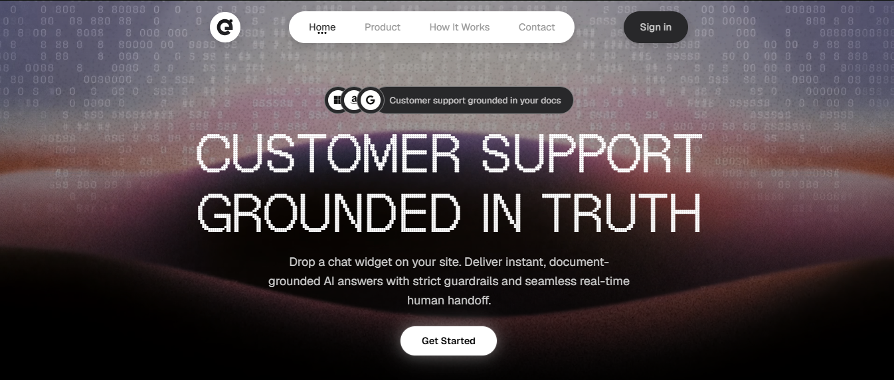
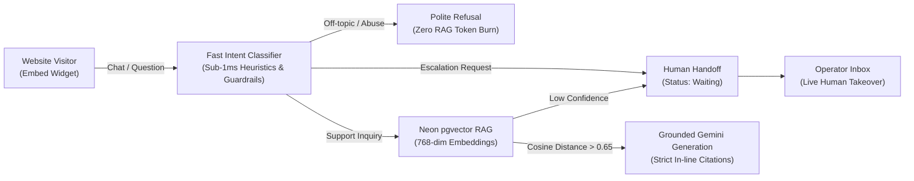

# GauravDesk Documentation Hub

  

Welcome to the official developer and operator documentation for **GauravDesk** — a high-trust, AI-driven customer support platform engineered with strict knowledge grounding, real-time human escalation, and a zero-bleed embeddable web widget.

---

## 📚 Documentation Index

| Guide | Description | Target Audience |
| :--- | :--- | :--- |
| [**Architecture & System Design**](file:///c:/Users/Ishika%20Sahu/Desktop/gauravdesk/docs/architecture.md) | High-level system architecture, the 7 moving pieces, Mermaid data flow diagrams, and database schema. | Architects & Engineers |
| [**Authentication Architecture**](file:///c:/Users/Ishika%20Sahu/Desktop/gauravdesk/docs/authentication.md) | Neon Auth (Managed Better Auth) integration, session cookies, OAuth, and magic links. | Full-Stack Developers |
| [**RAG Pipeline & Knowledge Ingestion**](file:///c:/Users/Ishika%20Sahu/Desktop/gauravdesk/docs/rag-and-knowledge-base.md) | Document parsing (PDF, MD, TXT), semantic chunking, Neon `pgvector` indexing, and citations. | AI & Backend Engineers |
| [**Guardrails & Intent Classification**](file:///c:/Users/Ishika%20Sahu/Desktop/gauravdesk/docs/guardrails-and-classification.md) | Fast regex heuristics, Gemini classifier, prompt-injection defense, and zero-token deflection. | AI Engineers & Operators |
| [**Widget Integration & Customization**](file:///c:/Users/Ishika%20Sahu/Desktop/gauravdesk/docs/widget-integration.md) | Embedding `widget.js`, iframe sandbox, postMessage protocol, domain whitelisting, and design customization. | Frontend Developers & Clients |
| [**Operator Inbox & Human Takeover**](file:///c:/Users/Ishika%20Sahu/Desktop/gauravdesk/docs/operator-inbox.md) | Real-time conversation triage (`Agent`, `Waiting`, `You`, `Closed`), live takeover, and visitor telemetry. | Support Teams & Operators |
| [**REST API Reference**](file:///c:/Users/Ishika%20Sahu/Desktop/gauravdesk/docs/api-reference.md) | Complete reference for `/api/chat`, `/api/knowledge`, `/api/workspace`, `/api/conversations`, and `/api/avatar/upload`. | API Consumers & Integrators |
| [**Deployment & Configuration**](file:///c:/Users/Ishika%20Sahu/Desktop/gauravdesk/docs/deployment-and-configuration.md) | Environment setup, database migrations, Neon Object Storage, and Vercel/production deployment. | DevOps & Site Reliability |

---

## ⚡ Quick Architectural Overview

GauravDesk follows Ryan Singer's "Fewer than 10 Moving Pieces" principle, cleanly separated into 7 core modules:

---

## 🛠️ Tech Stack at a Glance

* **Framework:** Next.js 16 (App Router) & React 19
* **Styling & Components:** Tailwind CSS v4, Lucide Icons, Shadcn UI primitives, Sonner toasts
* **Database & Search:** Neon Serverless PostgreSQL with `pgvector` (HNSW indexing)
* **Authentication:** Neon Auth (Managed Better Auth) with session cookies & Google OAuth
* **Object Storage:** Neon Object Storage (AWS S3-compatible) for custom avatars
* **AI & Embeddings:** Google Gemini (`gemini-2.5-flash` / `gemini-2.0-flash` & `gemini-embedding-001` / `text-embedding-004`)
