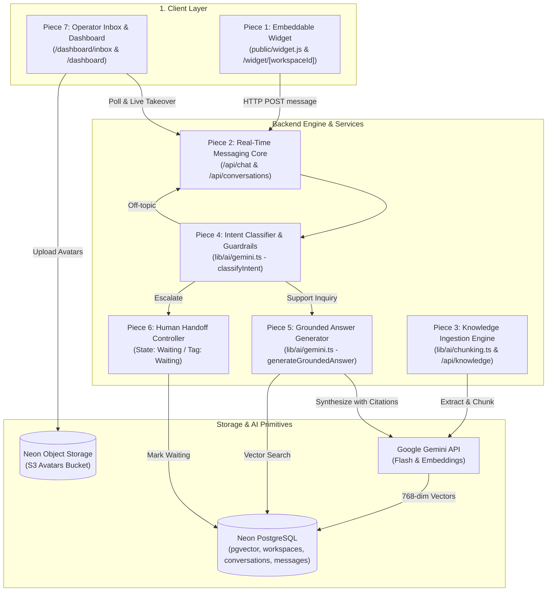
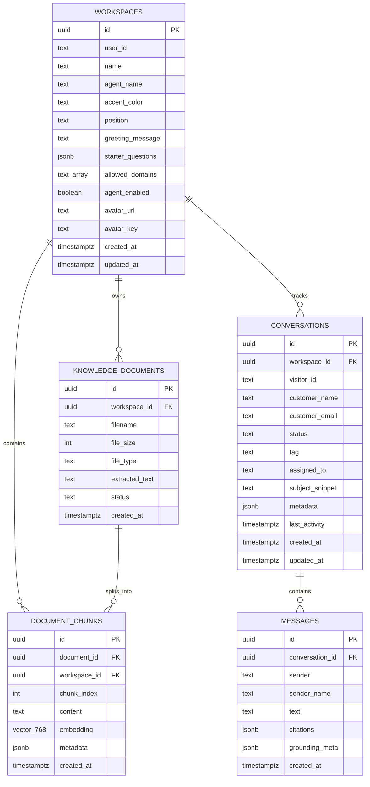

# System Architecture & Technical Design

**Platform:** GauravDesk  
**Architecture Principle:** Ryan Singer's "Fewer than 10 Moving Pieces"  
**Version:** 1.0 (Minimal Lovable Product)

---

## 1. Executive Summary

GauravDesk is an end-to-end customer support automation platform designed around three non-negotiable principles:
1. **Strict Knowledge Grounding:** Zero external hallucinations; answers are synthesized only from uploaded internal documentation.
2. **Deterministic Guardrails:** Off-topic queries, homework questions, or jailbreak attempts are immediately refused before triggering expensive RAG vector searches.
3. **Graceful Human Escalation:** Smooth, state-preserving handover to human operators when the visitor requests a human or when document relevance falls below 65%.

---

## 2. The 7 Moving Pieces



---

### Piece 1: Embeddable Web Widget (`<script>`)
* **Entrypoint:** [`public/widget.js`](file:///c:/Users/Ishika%20Sahu/Desktop/gauravdesk/public/widget.js)
* **Isolated Frame:** [`app/widget/[workspaceId]/page.tsx`](file:///c:/Users/Ishika%20Sahu/Desktop/gauravdesk/app/widget/%5BworkspaceId%5D/page.tsx)
* **Mechanism:** Injects a lightweight fixed-position iframe into the host website. Communication between the host and the iframe occurs through the window `postMessage` protocol to expand/collapse without CSS interference.

### Piece 2: Real-Time Messaging Core
* **Endpoints:** [`/api/chat`](file:///c:/Users/Ishika%20Sahu/Desktop/gauravdesk/app/api/chat/route.ts) and [`/api/conversations`](file:///c:/Users/Ishika%20Sahu/Desktop/gauravdesk/app/api/conversations/route.ts)
* **Functionality:** Handles anonymous visitor sessions (`visitor_id`), captures client metadata (browser, OS, device, referrer, timezone), persists message chains, and coordinates replies between AI and human agents.

### Piece 3: Knowledge Ingestion Engine (RAG Pipeline)
* **Components:** [`lib/ai/chunking.ts`](file:///c:/Users/Ishika%20Sahu/Desktop/gauravdesk/lib/ai/chunking.ts) & [`app/api/knowledge/route.ts`](file:///c:/Users/Ishika%20Sahu/Desktop/gauravdesk/app/api/knowledge/route.ts)
* **Functionality:** Parses PDF, Markdown, and TXT files up to 10 MB. Splits text into 1,200-character semantic chunks with 200-character overlap, generates 768-dimensional embeddings via Gemini, and indexes them in Neon PostgreSQL using `pgvector`. Automatically regenerates suggested starter questions upon knowledge base updates.

### Piece 4: Intent Classifier & Guardrails
* **Component:** [`lib/ai/gemini.ts`](file:///c:/Users/Ishika%20Sahu/Desktop/gauravdesk/lib/ai/gemini.ts) (`classifyIntent`)
* **Functionality:** High-speed deterministic evaluation targeting sub-1ms response times. Categorizes incoming messages into:
  - `SUPPORT`: Proceeds to vector search.
  - `OFF_TOPIC`: Returns an instant canned refusal without burning RAG or completion tokens.
  - `ESCALATE`: Instantly tags the conversation as `Waiting` and alerts the operator.

### Piece 5: Grounded Answer Generator
* **Component:** [`lib/ai/gemini.ts`](file:///c:/Users/Ishika%20Sahu/Desktop/gauravdesk/lib/ai/gemini.ts) (`generateGroundedAnswer`)
* **Functionality:** Executes cosine distance queries (`<=>`) against `document_chunks`. If the top chunk similarity is below `0.65`, triggers escalation. If relevant chunks exist, generates a factual answer referencing source documents and returns citations to the client.

### Piece 6: Human Handoff & Escalation Controller
* **State Updates:** In `conversations` table (`status: 'waiting'`, `tag: 'Waiting'`).
* **Functionality:** When escalation is triggered (either explicitly by the visitor or automatically by low RAG confidence), updates the conversation state so that subsequent visitor messages are queued directly for the operator rather than answered by the bot.

### Piece 7: Operator Inbox & Management Dashboard
* **Components:** [`components/operator-inbox/OperatorInbox.tsx`](file:///c:/Users/Ishika%20Sahu/Desktop/gauravdesk/components/operator-inbox/OperatorInbox.tsx) & [`components/dashboard/ChatbotCustomizer.tsx`](file:///c:/Users/Ishika%20Sahu/Desktop/gauravdesk/components/dashboard/ChatbotCustomizer.tsx)
* **Functionality:** Real-time dual-pane workspace for support staff:
  - Categorized queues: *All open*, *Waiting* (needs attention), *Agent* (AI responding), *You* (operator participating), *Closed*.
  - Live transcript inspection with grounding source cards and visitor metadata.
  - Direct operator message composer and resolution toggle.

---

## 3. Database Schema & Data Models

GauravDesk uses Neon Serverless PostgreSQL with the `vector` extension:



---

## 4. Conversation Lifecycle & State Machine

```mermaid
stateDiagram-v2
    [*] --> OpenAgent: Visitor initiates conversation
    note right of OpenAgent: Status: open<br/>Tag: Agent<br/>Bot answers via RAG

    OpenAgent --> WaitingQueue: Confidence < 0.65 OR "Talk to human"
    note right of WaitingQueue: Status: waiting<br/>Tag: Waiting<br/>Bot pauses responses

    WaitingQueue --> OperatorActive: Operator replies from Inbox
    note right of OperatorActive: Status: open<br/>Tag: You<br/>Operator in direct control

    OpenAgent --> OperatorActive: Operator takes over manually
    OperatorActive --> Closed: Operator marks resolved
    WaitingQueue --> Closed: Operator resolves directly
    OpenAgent --> Closed: Operator resolves

    Closed --> OpenAgent: Visitor sends new message
    Closed --> [*]
```

---

## 5. Security & Isolation Boundaries

1. **Workspace Partitioning:** Every query against `document_chunks`, `conversations`, and `messages` scopes strictly by `workspace_id = ${workspaceId}::uuid`.
2. **Domain Whitelisting:** Embedded widgets check request origin against `allowed_domains` stored in `workspaces`.
3. **Prompt Injection Hardening:** In `lib/ai/gemini.ts`, user queries are strictly demarcated from system instructions to prevent prompt override attacks.
4. **Token Exhaustion Defense:** Off-topic queries are caught at Step 1 via regex, preventing unauthorized consumption of vector search and generative LLM tokens.
