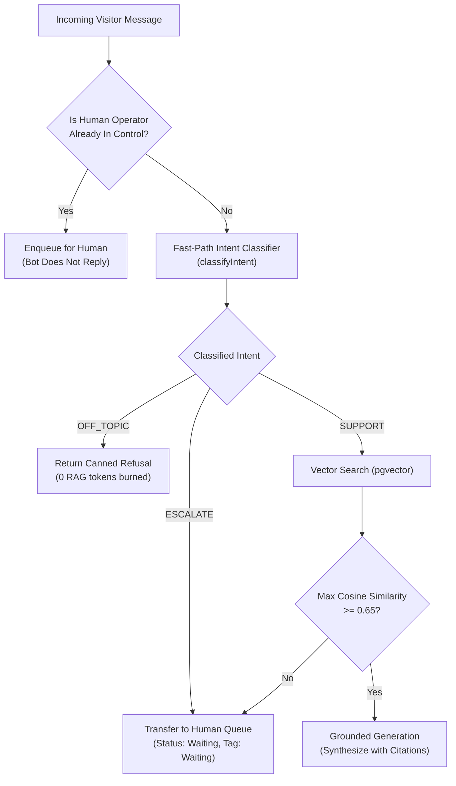

# Guardrails & Intent Classification

**Subsystem:** Request Guardrails & Real-Time Intent Routing  
**Evaluation Latency:** Sub-millisecond (deterministic fast path)  
**Token Burn on Off-Topic Queries:** Exactly 0 RAG / Completion tokens  
**Source Implementation:** [`lib/ai/gemini.ts`](file:///c:/Users/Ishika%20Sahu/Desktop/gauravdesk/lib/ai/gemini.ts) & [`app/api/chat/route.ts`](file:///c:/Users/Ishika%20Sahu/Desktop/gauravdesk/app/api/chat/route.ts)

---

## 1. Overview & Threat Model

Generic customer-facing AI bots suffer from three severe failure modes:
1. **Token Exhaustion & Denial-of-Wallet:** Attackers or casual users flood the bot with non-support queries ("write me a 5,000 word sci-fi novel", "solve my algebra homework"), burning expensive LLM tokens.
2. **Hallucination & Brand Liability:** When queried about unknown topics, naive bots make up plausible-sounding false answers.
3. **Bot Overriding Human Operators:** Without proper state tracking, bots continue auto-replying even after a human agent has joined the live chat.

GauravDesk solves all three challenges using a **layered guardrail architecture**.



---

## 2. Fast-Path Deterministic Classifier

Implemented in [`lib/ai/gemini.ts`](file:///c:/Users/Ishika%20Sahu/Desktop/gauravdesk/lib/ai/gemini.ts):

```ts
export async function classifyIntent(
  userMessage: string,
  agentName = "Gaurav Desk"
): Promise<{ intent: "SUPPORT" | "OFF_TOPIC" | "ESCALATE"; reason: string }>
```

### Classification Categories

#### A. Explicit Human Escalation (`ESCALATE`)
Detected via regex matching common human handoff requests:
```regex
\b(human|agent|representative|talk to someone|real person|operator|speak with someone|supervisor|support person|customer care)\b
```
* **System Action:**
  1. Sets conversation `status = 'waiting'` and `tag = 'Waiting'`.
  2. Replies instantly to visitor:
     > *"I'm looping in a human support operator to help you with this right now. Please hold on a moment."*
  3. Real-time badge counter increments in the Operator Inbox.

#### B. Off-Topic & Jailbreak Queries (`OFF_TOPIC`)
Detected via regex catching non-support queries:
```regex
\b(write a poem|write code|python script|solve math|solve equation|homework|tell a joke|tell me a story|weather today)\b
```
* **System Action:**
  1. Early-exits **before** any vector search or embedding generation.
  2. Replies instantly with a brand-safe canned refusal:
     > *"I am [Agent Name]. I can only assist with questions regarding our products, services, and documentation. How can I help you with those today?"*
  3. Keeps conversation `status = 'open'` and `tag = 'Agent'`.
  4. **Cost:** Zero vector similarity queries and zero Gemini generation tokens consumed.

#### C. Support Query (`SUPPORT`)
* Proceed to the Neon `pgvector` RAG pipeline.

---

## 3. Human Takeover Protection

When a human agent takes over a chat from the Operator Inbox:
1. The conversation `tag` is set to `Waiting` or `You`.
2. When the visitor sends a follow-up message:
   ```ts
   const isHumanOperatorActive =
     existingConv && (existingConv.tag === "Waiting" || existingConv.tag === "You" || existingConv.status === "waiting")

   if (isHumanOperatorActive && classification.intent !== "OFF_TOPIC") {
     return NextResponse.json({
       conversationId: convId,
       answer: null,
       status: existingConv.status || "waiting",
       tag: existingConv.tag || "Waiting",
       isHumanActive: true,
     })
   }
   ```
3. The AI agent **stays silent**. The visitor's message is inserted directly into the database and visible in real time inside the Operator Inbox for the human to answer.

---

## 4. Low-Confidence Fallback Guardrail

Even if an inquiry is categorized as `SUPPORT`, the documentation may not contain the answer. GauravDesk enforces a strict relevance threshold:

* **Threshold:** `MINIMUM_RELEVANCE = 0.65`
* **Trigger:** If the highest cosine similarity score among the top 4 chunks is `< 0.65`:
  ```ts
  const handoffMessage =
    "I couldn't find a sufficiently relevant answer in the knowledge base. I'm transferring this conversation to a human operator."
  ```
* The conversation is converted to `Waiting`, preventing speculative or hallucinated answers.

---

## 5. Prompt Injection Hardening

In [`generateGroundedAnswer`](file:///c:/Users/Ishika%20Sahu/Desktop/gauravdesk/lib/ai/gemini.ts#L189):
* User input is wrapped within explicit boundary delimiters (`Visitor Question: "{query}"`).
* The system instruction enforces that facts must **only** come from `Context Sources:`.
* System instructions are passed separately using the Gemini `systemInstruction` configuration parameter rather than concatenated into the user prompt, ensuring proper privilege separation.
