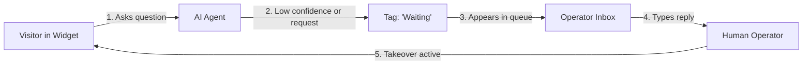

# Operator Inbox & Live Human Takeover

**Subsystem:** Business Operator Dashboard & Real-Time Inbox  
**Components:** [`components/operator-inbox/OperatorInbox.tsx`](file:///c:/Users/Ishika%20Sahu/Desktop/gauravdesk/components/operator-inbox/OperatorInbox.tsx), [`ConversationListPanel.tsx`](file:///c:/Users/Ishika%20Sahu/Desktop/gauravdesk/components/operator-inbox/ConversationListPanel.tsx), [`CustomerPreviewModal.tsx`](file:///c:/Users/Ishika%20Sahu/Desktop/gauravdesk/components/operator-inbox/CustomerPreviewModal.tsx)  
**Route:** [`/dashboard/inbox`](file:///c:/Users/Ishika%20Sahu/Desktop/gauravdesk/app/dashboard/inbox/page.tsx)

---

## 1. Overview

The **Operator Inbox** is the mission-control interface for human support teams. When the AI agent encounters an ambiguous inquiry, low document confidence ($< 0.65$), or when a visitor explicitly requests a human, the conversation is routed into the Operator Inbox for instant takeover.



---

## 2. Conversation Triage & Queue Filters

The left-hand panel categorizes conversations into distinct triage queues:

| Queue Filter | Condition | Purpose |
| :--- | :--- | :--- |
| **All open** | `status != 'closed'` | Broad overview of all unresolved customer conversations. |
| **Waiting** | `tag == 'Waiting' && status != 'closed'` | **High-priority queue:** Conversations escalated by the AI or directly requesting a human operator. Shows a persistent alert badge counter. |
| **Agent** | `tag == 'Agent' && status != 'closed'` | Conversations currently being handled autonomously by the AI agent. |
| **You** | `tag == 'You' || assigned_to == 'Operator'` | Conversations where the current human operator has sent a reply. |
| **Closed** | `status == 'closed'` | Resolved conversation history archive. |

### Real-Time Search
Support operators can search in real time across customer names, visitor IDs, and subject snippets using the built-in search bar.

---

## 3. Transcript Inspection & Grounding Transparency

The conversation transcript provides complete visibility into AI reasoning:
* **Visitor Messages:** Rendered with device, browser, and timestamp indicators.
* **Agent Messages:** Rendered with **Grounded Source Badges** indicating the specific files that informed the AI's reply (e.g. `[Source: refund-policy.pdf]`).
* **Operator Messages:** Distinguished with high-contrast operator badges and delivery timestamps.

---

## 4. Live Takeover Flow

```mermaid
sequenceDiagram
    autonumber
    actor Visitor
    participant Widget as Chat Widget
    participant DB as Neon Database
    participant Inbox as Operator Inbox
    actor Operator

    Visitor->>Widget: "I need to talk to a manager"
    Widget->>DB: POST /api/chat
    DB->>DB: Set status='waiting', tag='Waiting'
    Widget-->>Visitor: "Transferring you to an operator..."
    Inbox->>DB: Polling sync (/api/conversations)
    Inbox-->>Operator: Increments "Waiting" badge
    Operator->>Inbox: Clicks conversation, reads transcript
    Operator->>Inbox: Types message & hits Send
    Inbox->>DB: POST /api/conversations (replyText, tag='You')
    DB-->>Widget: Message delivered to visitor
    Note over Widget,DB: AI stops replying; operator is in full control
```

### Taking Over a Conversation
1. Select the conversation in the `Waiting` queue.
2. Review the visitor's previous messages and metadata in the right-hand panel.
3. Type a reply into the composer and press **Send** (or `Enter`).
4. **State Transition:** The conversation tag switches to `You`, marking the chat as operator-managed. Subsequent visitor messages will not trigger automated bot replies.

---

## 5. Visitor Telemetry & Metadata Inspector

Operators can inspect detailed visitor context by opening the **Customer Preview Modal**:

| Metadata Field | Captured Value | Support Benefit |
| :--- | :--- | :--- |
| **Visitor ID** | Unique UUID / local storage identifier | Correlates repeat visits across sessions. |
| **Device & OS** | e.g. `Desktop (macOS)` or `Mobile (Android)` | Helps reproduce UI or technical issues. |
| **Browser** | e.g. `Chrome 122` or `Safari 17` | Clarifies browser-specific bugs. |
| **Timezone & Local Time** | e.g. `America/New_York (10:45 AM)` | Informs operators about the user's business hours. |
| **Landing Page** | `window.location.href` | Shows the exact page where the visitor encountered trouble. |
| **Referrer** | `document.referrer` | Shows whether the visitor arrived from Google, Twitter, or direct link. |

---

## 6. Resolving Conversations

* Once an issue is addressed, the operator clicks **Mark as Closed**.
* The conversation moves from active queues to the `Closed` tab.
* If the visitor sends another message in the future, the conversation automatically re-opens.
