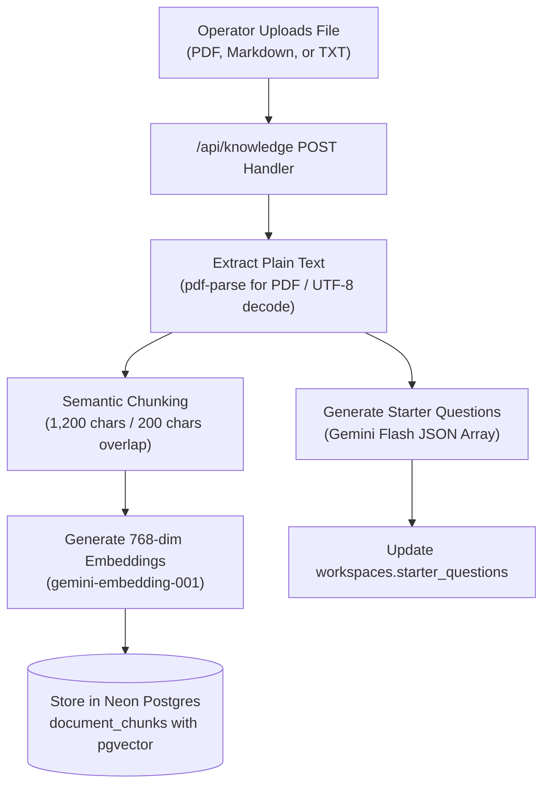

# RAG Pipeline & Knowledge Ingestion Engine

**Subsystem:** Knowledge Ingestion & Vector Retrieval  
**Vector Engine:** Neon PostgreSQL `pgvector` (Cosine Distance `<=>`)  
**Embedding Dimensionality:** 768 dimensions  
**Embedding Models:** `gemini-embedding-001` / `gemini-embedding-2`  
**Completion Models:** `gemini-3.8-flash` / `gemini-3.7-flash` / `gemini-3.5-flash`

---

## 1. Overview

The GauravDesk Retrieval-Augmented Generation (RAG) engine powers the AI support agent's brain. Unlike generic LLM bots that generate answers from broad Internet pre-training, GauravDesk answers visitor inquiries **strictly and exclusively** from documents uploaded by operators.



---

## 2. Document Ingestion & Parsing

Document uploads are handled by [`app/api/knowledge/route.ts`](file:///c:/Users/Ishika%20Sahu/Desktop/gauravdesk/app/api/knowledge/route.ts).

### Ingestion Constraints & Validation
* **Supported file types:** `.pdf`, `.md`, `.txt`
* **File size limit:** 10 MB maximum
* **Extraction techniques:**
  - **PDF:** Extracted asynchronously using `pdf-parse` (v2.4.5) to parse raw text streams from PDF buffers.
  - **Markdown / Plain Text:** Decoded directly from binary buffers using standard UTF-8 string encoding.
* **Failure isolation:** If embedding generation fails for any reason during ingestion, the document record is automatically purged via transactional rollback to keep the index clean.

---

## 3. Semantic Chunking Strategy

Implemented in [`lib/ai/chunking.ts`](file:///c:/Users/Ishika%20Sahu/Desktop/gauravdesk/lib/ai/chunking.ts).

```ts
export function chunkText(
  text: string,
  targetChunkChars = 1200,
  overlapChars = 200
): TextChunk[]
```

### Key Chunking Principles
1. **Paragraph Continuity:** Text is split primarily along natural paragraph breaks (`\n\n+`) rather than arbitrary character slices to preserve sentence context.
2. **Chunk Size:** Target chunk length is set to **1,200 characters** (~250-300 tokens), optimal for fine-grained factual matching.
3. **Sliding Overlap:** A **200-character trailing window** is copied into the beginning of the subsequent chunk. This prevents critical statements spanning chunk boundaries from losing semantic cohesion.
4. **Light Documents:** Documents shorter than 1,200 characters are stored as a single coherent chunk.

---

## 4. Vector Embeddings & Neon `pgvector`

### Schema Definition
```sql
CREATE EXTENSION IF NOT EXISTS vector;

CREATE TABLE IF NOT EXISTS document_chunks (
  id UUID PRIMARY KEY DEFAULT gen_random_uuid(),
  document_id UUID REFERENCES knowledge_documents(id) ON DELETE CASCADE,
  workspace_id UUID REFERENCES workspaces(id) ON DELETE CASCADE,
  chunk_index INT NOT NULL DEFAULT 0,
  content TEXT NOT NULL,
  embedding vector(768),
  metadata JSONB DEFAULT '{}'::jsonb,
  created_at TIMESTAMPTZ NOT NULL DEFAULT NOW()
);
```

### Embedding Generation
Embeddings are computed in [`lib/ai/gemini.ts`](file:///c:/Users/Ishika%20Sahu/Desktop/gauravdesk/lib/ai/gemini.ts) via `generateEmbedding(text: string)`:
* Uses Google Gemini embedding models (`gemini-embedding-001` or `gemini-embedding-2`).
* Configured with `outputDimensionality: 768`.
* Input text is clipped safely to 8,000 characters before embedding to guarantee provider token limits are never violated.

---

## 5. Similarity Search & Retrieval Pipeline

When a visitor submits a support question to [`/api/chat`](file:///c:/Users/Ishika%20Sahu/Desktop/gauravdesk/app/api/chat/route.ts):

### A. Vector Query
The visitor's query text is embedded into a 768-dimensional vector and matched against all chunks belonging to the current workspace:

```sql
SELECT 
  content,
  COALESCE(metadata->>'filename', 'Knowledge Document') as filename,
  (1 - (embedding <=> ${queryVecStr}::vector)) as similarity
FROM document_chunks
WHERE workspace_id = ${targetWorkspaceId}::uuid
  AND embedding IS NOT NULL
ORDER BY embedding <=> ${queryVecStr}::vector
LIMIT 4;
```

### B. Similarity Threshold & Low-Confidence Guardrail
* GauravDesk converts cosine distance (`<=>`) to cosine similarity via `1 - distance`.
* **Relevance Cutoff (`MINIMUM_RELEVANCE = 0.65`):**
  - If the top result's similarity is **$\ge$ 0.65**: The top 4 chunks are passed to the grounded generator.
  - If the top result's similarity is **$<$ 0.65**: The query is treated as low confidence. The system declines to guess and triggers **Piece 6 (Human Handoff)**:
    ```
    "I couldn't find a sufficiently relevant answer in the knowledge base. 
     I'm transferring this conversation to a human operator."
    ```
    The conversation tag changes to `Waiting`, notifying operators in the inbox.

---

## 6. Grounded Answer Synthesis & Citations

Implemented in [`lib/ai/gemini.ts`](file:///c:/Users/Ishika%20Sahu/Desktop/gauravdesk/lib/ai/gemini.ts) via `generateGroundedAnswer`:

### System Instruction Constraints
```
You are {agentName}, an intelligent customer support assistant.
Strict Grounding Rules:
1. Answer the visitor's question ONLY using the facts present in the provided context sources below.
2. If the context does not provide sufficient facts to answer the question with certainty, politely state that you do not have that information in your knowledge base and offer to transfer them to a human team member.
3. NEVER make up external facts or assumptions.
4. Keep the tone professional, helpful, concise, and friendly.
```

### Inline Citations & Metadata Output
Each synthesized response returns:
1. `answer`: The grounded markdown response.
2. `citations`: A deduplicated list of source filenames that informed the answer (e.g. `["refund-policy.pdf", "pricing-faq.md"]`).
3. `groundingExplanation`: Telemetry explaining which sources were used and the query execution latency.

---

## 7. Dynamic Starter Questions Generation

Whenever a document is uploaded or deleted, GauravDesk triggers `generateSuggestedQuestionsFromKnowledge`:
1. Concatenates up to 24,000 characters across all remaining knowledge documents.
2. Sends the context to Gemini with structured JSON output instructions:
   ```
   "Create up to four concise questions that a customer might ask, 
    using only information explicitly present in these support documents..."
   ```
3. Parses, deduplicates, and validates that each question ends with `?` and is between 12 and 120 characters long.
4. Persists the result into `workspaces.starter_questions`.
5. The widget and preview automatically display these interactive starter buttons so visitors can click to ask common questions without typing.
