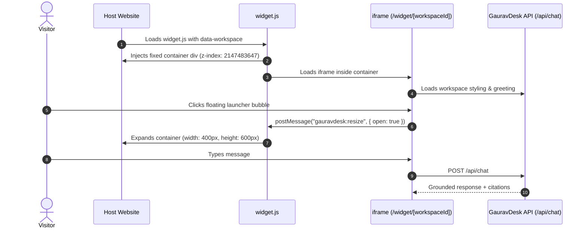

# Widget Integration & Customization Guide

**Subsystem:** Embeddable Client Widget  
**Script Asset:** [`public/widget.js`](file:///c:/Users/Ishika%20Sahu/Desktop/gauravdesk/public/widget.js)  
**Hosted Frame:** [`app/widget/[workspaceId]/page.tsx`](file:///c:/Users/Ishika%20Sahu/Desktop/gauravdesk/app/widget/%5BworkspaceId%5D/page.tsx)  
**Verification Page:** [`app/test-embed/page.tsx`](file:///c:/Users/Ishika%20Sahu/Desktop/gauravdesk/app/test-embed/page.tsx)

---

## 1. Quick Integration (1-Line Embed)

To embed GauravDesk on any website (HTML, React, Next.js, WordPress, Shopify, Webflow), paste the following snippet before the closing `</body>` tag:

```html
<script 
  src="https://your-gauravdesk-domain.com/widget.js" 
  data-workspace="YOUR_WORKSPACE_UUID"
  data-position="bottom-right"
  async
></script>
```

### Script Tag Attributes

| Attribute | Type | Default | Description |
| :--- | :--- | :--- | :--- |
| `data-workspace` | UUID string | *(Required)* | Your unique workspace UUID found in the Dashboard. |
| `data-position` | `"bottom-right"` \| `"bottom-left"` | `"bottom-right"` | Corner where the floating chat bubble appears. |
| `src` | URL | *(Required)* | Full path to `widget.js` on your GauravDesk deployment. |

---

## 2. Technical Architecture: Zero CSS Bleed

To guarantee that your host website's stylesheets (Bootstrap, Tailwind, custom styles) do not affect the widget, and that the widget does not pollute host styling, GauravDesk uses **iframe isolation**:



### Window `postMessage` Protocol
The iframe and host window communicate asynchronously via postMessage:
* **Frame $\rightarrow$ Host:**
  - `{ type: "gauravdesk:resize", open: true, position: "bottom-right" }`: Tells `widget.js` to expand the container to `400px x 620px` (or `100vw x 100vh` on mobile devices).
  - `{ type: "gauravdesk:resize", open: false, position: "bottom-right" }`: Tells `widget.js` to collapse the container back to an `80px x 80px` floating circle.

---

## 3. JavaScript SDK (`window.GauravDesk`)

Once `widget.js` runs, it exposes a lightweight global client API on the host page:

```javascript
// Toggle widget visibility
window.GauravDesk.toggle();

// Programmatically open widget
window.GauravDesk.open();

// Programmatically close widget
window.GauravDesk.close();

// Check if widget is initialized
console.log(window.GauravDesk.isLoaded); // true
```

### Example: Triggering from a Custom Button
```html
<button onclick="window.GauravDesk.open()">
  Chat with Support
</button>
```

---

## 4. Domain Whitelisting & Security

GauravDesk enforces domain whitelisting to protect against unauthorized embed reuse:
1. In the Dashboard (**Widget Settings**), operators specify **Allowed Domains** (e.g. `example.com`, `app.example.com`, `localhost:3000`).
2. When the widget loads or submits a chat request, the request origin is checked against the workspace's `allowed_domains` array.
3. If the host domain is not registered, the widget gracefully refuses to mount.

---

## 5. Visual Customization

All customizations can be modified live in the Dashboard (**Home / Chatbot Customizer**) with instant preview:

### A. Agent Identity & Name
* Customizable in `workspaces.agent_name`.
* Rendered in the widget header and alongside bot messages.

### B. Custom Avatar (Neon Object Storage S3)
* Operators can upload PNG, JPEG, WebP, GIF, or SVG avatars up to 5 MB.
* Files are uploaded to S3-compatible Neon Object Storage via [`/api/avatar/upload`](file:///c:/Users/Ishika%20Sahu/Desktop/gauravdesk/app/api/avatar/upload/route.ts).
* If no custom image is uploaded, GauravDesk displays a stylish 3D Glossy Orb avatar.

### C. Accent Colors
7 curated high-contrast color themes are supported:
* **Blue:** `#2563eb`
* **Indigo:** `#4f46e5`
* **Violet:** `#9333ea`
* **Pink:** `#db2777`
* **Red:** `#dc2626`
* **Orange:** `#ea580c`
* **Green:** `#16a34a`

### D. Greeting & Suggested Starter Questions
* **Greeting:** Configurable initial message (up to 300 characters) displayed before the visitor types.
* **Suggested Questions:** Up to 4 clickable chips displayed when the visitor opens the widget. These chips are automatically generated from uploaded documentation.

---

## 6. Standalone Widget Mode

For testing or integration into native webviews, the widget can be opened directly at:
```
https://your-domain.com/widget/[workspaceId]
```
Or verified locally using the built-in testbed at [`/test-embed`](file:///c:/Users/Ishika%20Sahu/Desktop/gauravdesk/app/test-embed/page.tsx).
